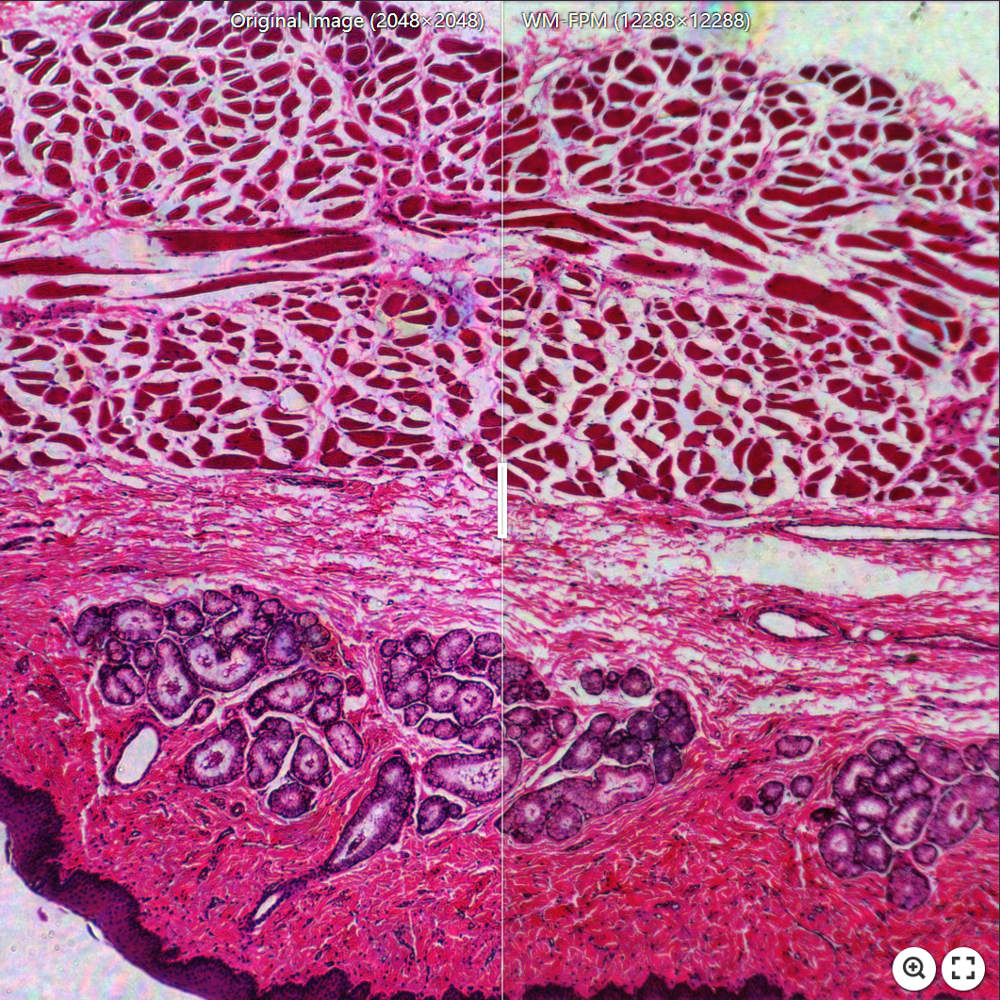
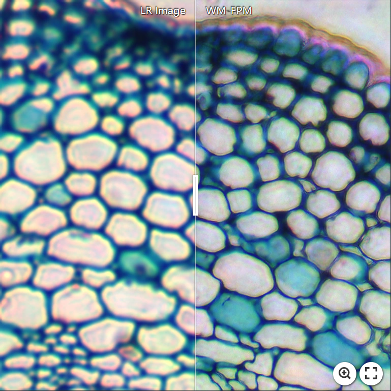
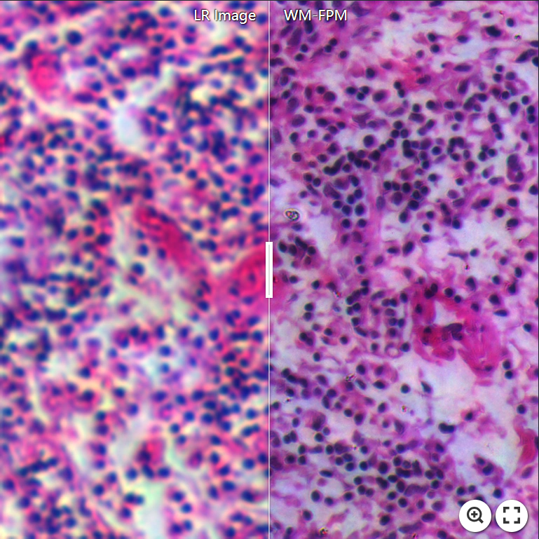

# WM-FPM

A generative adversarial framework for FPM reconstruction, termed WM-FPM, integrates wavelet transform blocks and mamba-inspired linear attention models.

This repository contains the official implementation of the paper **"Fast High-Fidelity Fourier Ptychographic Microscopy via Wavelet Transform and Linear Attention"**.

✨ _**Some visual examples**_:

[](https://imgsli.com/NDIzMDYw)

[](https://imgsli.com/NDIzMDY2) [](https://imgsli.com/NDIzMDcx)

## 🛠 Environment Setup

This project requires Python 3.9 and PyTorch 2.5.1. Follow these steps to set up the environment:

### 1. Clone Repository
```bash
git clone https://github.com/ww20250822/WM-FPM.git
cd WM-FPM
```
### 2. Create Conda Environment
```bash
conda create -n wm-fpm python=3.9
conda activate wm-fpm
```
### 3. Install Dependencies
```bash
pip install -r requirements.txt
```
## 📊 Dataset
1.Download datasets from **[FPM-BioCell](https://www.kaggle.com/datasets/lijiajin521314/fpm-biocell)**

2.Extract files to the **datasets** directory

3.The processing method of the dataset can be found in **[pytorch-CycleGAN-and-pix2pix](https://github.com/junyanz/pytorch-CycleGAN-and-pix2pix)**.

## 🏋️ WM-FPM train/test
### 1. Train
```bash
python train.py --dataroot ./datasets/FPM --name WM_FPM --model pix2pix --netG WM-FPM --direction BtoA
```
To see more intermediate results, check out `./checkpoints/WM_FPM/web/index.html`.
### 2. Test
```bash
python test.py --dataroot ./datasets/FPM --name WM_FPM --model pix2pix --netG WM-FPM --direction BtoA
```
The test results will be saved to a html file here: `./results/WM_FPM/test_latest/index.html`.

## 📚 Acknowledgements
Our codebase is built with references to the following open-source projects:
- [pytorch-CycleGAN-and-pix2pix](https://github.com/junyanz/pytorch-CycleGAN-and-pix2pix): The CycleGAN and pix2pixGAN models were implemented using PyTorch.

We sincerely appreciate the authors for open-sourcing their valuable work.
## 📝 Citation
If you use this code for your research, please cite our paper.
